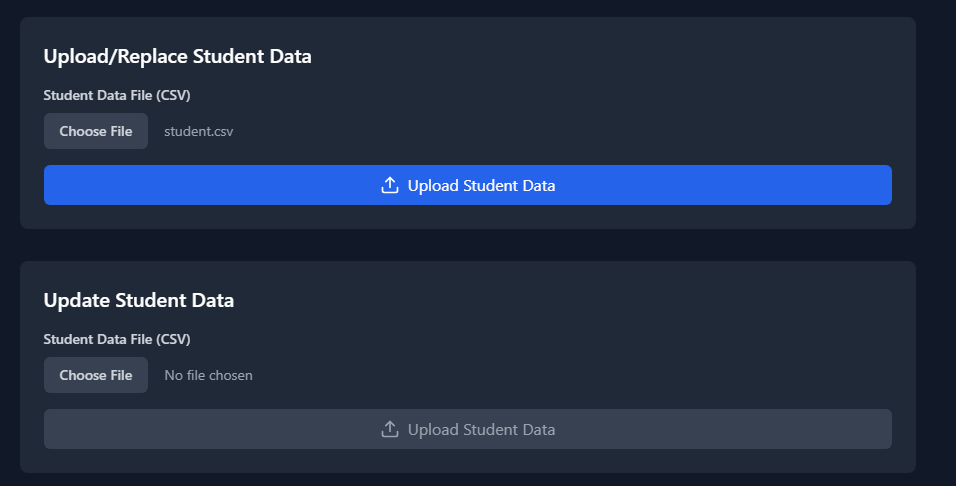

# BCIT-Global-Relations-Office-Timetable-Dashboard

  
  

<h3 align="center">Timecheck</h3>

  

    A web application to increase timetable creation efficiency.
     
  

## About Us

COMP 4800 Team #1

Team #1 is a group of 4 students passionate about create new projects with Python. Throughout this project, we've learned many new and interesting technologies.

We are:

- [Arman Chinai](https://github.com/ChinaiArman)
- [Charlie Zhang](https://github.com/cz1501)
- [Kate Sullivan](https://github.com/katesully)
- [Lex Wong](https://github.com/levxxvi)

## About the Project

Timecheck was created to help make timetable creation easier. It aids timetable creation through allowing users to upload course information and student information, users can easily reference 

## Built With

This web application was developed with the following technologies and frameworks:

- Application Load Balancer
- AWS Amplify
- Certificate Manager
- EC2
- Elastic Beanstalk
- Flask
- GitHub
- MySql
- Pandas
- Python
- RDS
- React
- Route 53
- S3
- Tailwind
