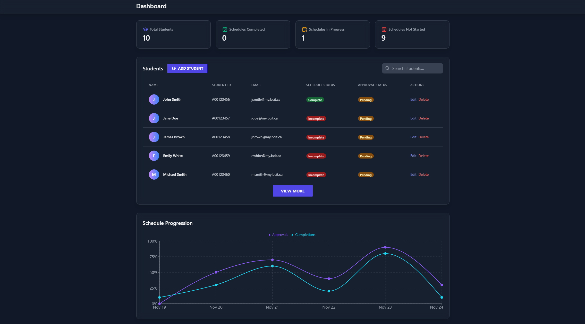

# BCIT-Global-Relations-Office-Timetable-Dashboard

  

<h3 align="center">Timetable Checker Dashboard</h3>

  

    A web application to increase timetable creation efficiency.
     
  

## About Us

COMP 4800 Team #1

Team #1 is a group of 4 students passionate about create new projects with Python. Throughout this project, we've learned many new and interesting technologies.

We are:

- [Arman Chinai](https://github.com/ChinaiArman)
- [Charlie Zhang](https://github.com/cz1501)
- [Kate Sullivan](https://github.com/katesully)
- [Lex Wong](https://github.com/levxxvi)

## About the Project

Timetable Checker Dashboard was created to help make timetable creation easier. It aids timetable creation through allowing users to upload course information and student information, users can easily reference 

## Built With

This web application was developed with the following technologies and frameworks:

